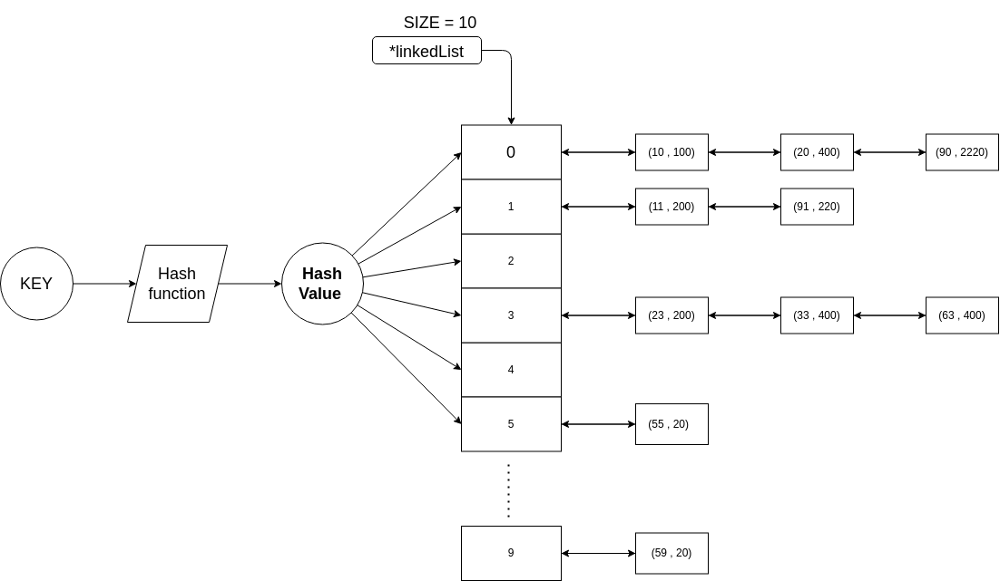

# Hash Table with Double Linked List Collision Handling

This project implements a hash table data structure that uses double linked lists to handle collisions. The hash table provides efficient key-value storage and retrieval operations with constant-time average-case performance.
<p align="center">

</p>

## Features

- **Hash Table Data Structure**: The hash table is implemented as an array of double linked lists, with each index in the array representing a "bucket" that can store multiple key-value pairs.
- **Hash Function**: A simple modulo-based hash function is used to map keys to indices within the hash table.
- **Double Linked List Nodes**: Each node in the linked list stores a key-value pair (represented by the `HashEntry` class) and maintains references to the previous and next nodes in the list.
- **Insertion, Lookup, and Deletion**: The hash table supports efficient insertion, lookup, and deletion of key-value pairs, with collisions handled by appending new entries to the linked list at each index.
- **Collision Handling**: When a collision occurs (i.e., two keys hash to the same index), the new entry is added to the linked list at that index, maintaining the list in sorted order based on the key.

## Usage

To use the hash table implementation, follow these steps:

1. Clone the ropo :
   ```bash
   git clone git@github.com:AbderrahimeEl/Hash-Table.git
   ```
2. Compile the progrum
   ```bash
   bash bash.sh
   ```
3. run
   ```bash
   ./bin/output
   ```

Here's an example usage:

```cpp
HashTable ht(10);
    ht.ht_insert(10, 100);
    ht.ht_insert(23, 200);
    ht.ht_insert(11, 200);
    ht.ht_insert(90, 2220);
    ht.ht_insert(91, 220);
    ht.ht_insert(20, 400);
    ht.ht_insert(33, 400);
    ht.ht_insert(63, 400);
    ht.ht_insert(55, 20);
    ht.ht_insert(59, 20);
    cout << "Hash Table:" << endl;
    ht.display();
```

## output : 

Hash Table: <br>
index = 0       size = 3     elemnets :(10 , 100)   (20 , 400)   (90 , 2220)   

index = 1       size = 2     elemnets :(11 , 200)   (91 , 220)   

index = 3       size = 3     elemnets :(23 , 200)   (33 , 400)   (63 , 400)   

index = 5       size = 1     elemnets :(55 , 20)   

index = 9       size = 1     elemnets :(59 , 20)   
